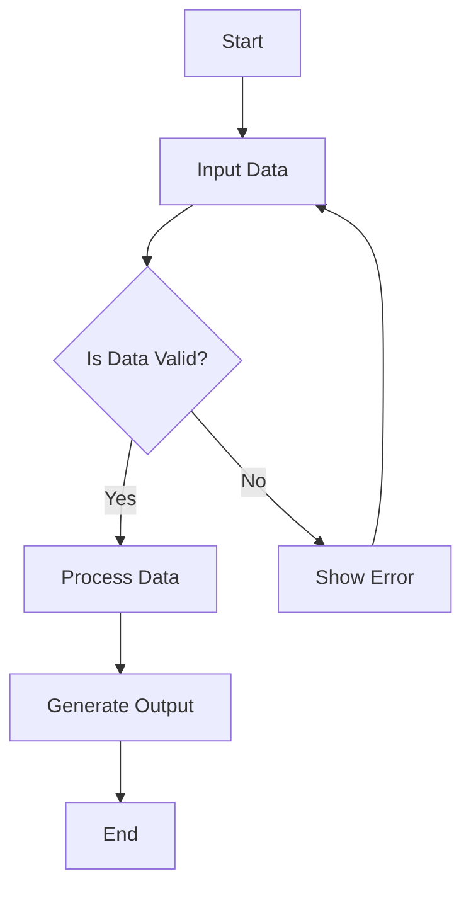

## 1. Data Extraction

### Download from kaggle
- For data extraction Kaggle recommended using their newer framework of 'kagglehub' to handle downloading data sets. 
- The data is being downloaded into a local to the project folder called 'data'. 
- The data is coming as a CSV. 

### Data profiling
- After downloading the data set, I did take a quick look it in Google Sheets.
- I noticed a few things:
  - Branch
    - On a simple analysis, this seems to be 1:1 with city, which would make it redundant, but we should keep it in 
    case a city gets a different branch.
  - Tax 5%
    - This is an odd column, because it matches the amount in 'gross income', gross income is profit but this is 
    labeled as tax.
    - I plan on changing this to markup_rate and moving it to a dimension table and setting it a constant of 5%
  - gross income
    - I plan on changing this to markup_amount which will be tied to the multiplying COGS by markup_rate
  - gross_margin_percentage
    - Like I mention before, this dataset is odd, this is just the gross income or the Tax at 5% on COGS divided by the 
    total cost of the purchase. Because the markup is all the same, this is just a repetitive number that can be 
    calculated at any time. I will leave out of the base tables.

| Column                  | Example           | Description                                          | Data Type |
|-------------------------|-------------------|------------------------------------------------------|-----------|
| Invoice ID              | 750-67-8428       | Unique ID                                            | string    |
| Branch                  | A                 | Store Branch                                         | string    |
| City                    | Yangon            | City in Myanmar                                      | string    |
| Customer type           | Member            | If the purchaser is a member or just a normal person | string    |
| Gender                  | Female            | Member gender                                        | string    |
| Product line            | Health and beauty | The general type of product purchased                | string    |
| Unit price              | 74.69             | Price per unit of item purchased                     | decimal   |
| Quantity                | 7                 | Number of item purchased                             | integer   |
| Tax 5%                  | 26.1415           | (Unit Price) * Quantity * 0.05                       | decimal   |
| Total                   | 548.9715          | (Unit Price) * Quantity * 1.05                       | decimal   |
| Date                    | 1/5/2019          | Date of purchase                                     | string    |
| Time                    | 13:08             | Time down to minute of purchase                      | string    |
| Payment                 | Ewallet           | Method of purchase                                   | string    |
| cogs                    | 522.83            | (Unit Price) * Quantity                              | decimal   |
| gross margin percentage | 4.761904762       | (Unit Price) * Quantity * 0.05 / Total               | decimal   |
| gross income            | 26.1415           | (Unit Price) * Quantity * 0.05                       | decimal   |
| Rating                  | 9.1               | Rating on shopping experience                        | decimal   |


## 2. Schema Design
### Dimension Tables
- 'customer' table

| Original Column | New Column    | Data Type                         |
|-----------------|---------------|-----------------------------------|
| -               | customer_id   | INTEGER PRIMARY KEY AUTOINCREMENT |
| Gender          | gender        | TEXT                              |
| Customer type   | customer_type | TEXT                              |

- 'product_location' table

| Original Column | New Column          | Data Type                         |
|-----------------|---------------------|-----------------------------------|
| -               | product_location_id | INTEGER PRIMARY KEY AUTOINCREMENT |
| Product line    | product_line        | TEXT                              |
| Branch          | branch              | TEXT                              |
| City            | city                | TEXT                              |
| Tax 5% / cogs   | markup_rate         | REAL                              |

### Fact Table
- 'sales' table

| Original Column | New Column          | Data Type                                                                                    |
|-----------------|---------------------|----------------------------------------------------------------------------------------------|
| Invoice ID      | invoice_id          | TEXT PRIMARY KEY                                                                             |
| -               | customer_id         | INTEGER, FOREIGN KEY (customer_id) REFERENCES customer (customer_id)                         |
| -               | product_location_id | INTEGER, FOREIGN KEY (product_location_id) REFERENCES product_location (product_location_id) |
| Quantity        | quantity            | INTEGER                                                                                      |
| Unit price      | unit_price          | REAL                                                                                         |
| gross income    | markup_amount       | REAL                                                                                         |
| Total           | total               | REAL                                                                                         |
| Date            | date                | TEXT                                                                                         |
| Time            | time                | TEXT                                                                                         |
| Payment         | payment             | TEXT                                                                                         |
| Rating          | rating              | REAL                                                                                         |


## 3. Transform and Load Data




```

### Data processing
- I will use a dataframe framework to process the data. 
I decided to use the pandas package over pyspark, mainly because the integration between pandas and sqlite seems to be stronger.
- Using pandas

# r"""
#
# gross margin percentage | 4.761904762 | ( total - cogs ) / total --> this computed and not stored in fact table because it will break aggregation, also is technically duplicated data
# cogs                    | 164.52      | quanity * unit_price
# gross_income            | 8.226       | this is just the same as tax rate (now markup because we don't seem to know the tax rate), eiter way it is duplicate data
#
#
# dim_customer
# --------------------------
# customer_id
# customer_type           | Member
# gender                  | Female
#
#
# dim_product_location
# --------------------------
# product_location_id
# product_line            | Food and beverages
# branch                  | B
# city                    | Mandalay
# markup_rate             | 0.05
#
#
# fact_sales
# --------------------------
# invoice_id              | 692-92-5582
# customer_id
# product_location_id
# quantity                | 3
# unit_price              | 54.84
# markup_amount           | 8.226
# total                   | 172.746
# date                    | 2/20/2019
# time                    | 13:27
# payment                 | Credit card
# rating                  | 5.9
# """
#


```